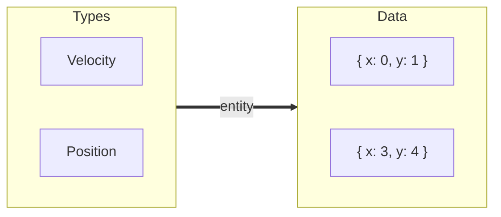
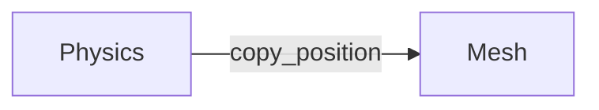

# ECS

This package contains code for logically representing the game world.

## Theory

Every "thing" in the real world _has_ properties, and _does_ behaviors.

A duck _is_ yellow, and it _does_ quack when it's hungry.

Similarly, every "thing" which exists in the video game is composed of properties
and behaviors, too.
These "things" are called **entities**.
Their properties are called **components**.  These are just small chunks of data.
Different behaviors are implemented by running a chunk of code on every entity
which contains the relevant components (think: data) for that behavior.

For example, a `QuackWhenHungry` behavior would be implemented by finding every
entity that has a `DuckComponent` and a `HungryComponent`, and then playing a
quack sound.

## World

An `EntityManager` stores components in linear memory so that it's very fast to run code repeatedly on all components of a type.

> In reality, the V8 JavaScript Engine might be storing an array of pointers, which defeats the performance benefit.

## Entity

An entity is a unique map between a set of types and a set of data.




We can use `world.spawn(types, data)` to make an entity.

```ts
import { EntityManager } from '@grove/ecs';

class Velocity {
    x: number = 0;
    y: number = 0;
};

class Position {
    x: number = 0;
    y: number = 0;
};

const world = new EntityManager();

const entity = world.spawn(
    [Position, Velocity],
    [{ x: 0, y: 1}, { x: 3, y: 4 }]
);
```

## Rules

Rules are behaviors that get executed every frame.

Rules have a **name**, a set of **types**, and a **function** to execute.

- The **types** specify what kind of information this rule should apply to.

- The **function** will be applied to each entity matching that set of types.

For example, imagine a rule that synchronizes renderable objects with their physically simulated positions.



This rule operates on the `Physics` and `Mesh` types, and the function is `copy_position`.  Here's how it looks in code:

```ts
/**
 * @example demonstrating a rule which applies
 * a physically-simulable entity's position
 * onto its mesh, thus visually moving it
 * across the screen.
 **/

import { EntityManager } from '@grove/ecs';
import { PhysicsData, PhysicsEngine } from '@grove/physics';
import { MeshData } from '@grove/graphics';

declare let physics: PhysicsEngine<unknown>;
declare let world: EntityManager;

world.addRule({
    name: 'Physics affects graphics',
    types: [PhysicsData, MeshData],
    fn([body, mesh]) {
        const [px, py, pz] = physics.getBodyPosition(body);
        mesh.position.set(px, py, pz);
    }
});

```

## Effects

Effects happen when a component is added to, or removed from, an entity.

Here's an example that uses effects to automate some boring work, like adding or removing a mesh from the scene graph.

```ts
/**
 * @example demonstrating an effect which
 * adds newly created meshes to the scene
 * and removes recently removed meshes
 * from the scene.
 **/

import { EntityManager } from '@grove/ecs';
import { Mesh, Scene } from 'three';

const world = new EntityManager();
const scene = new Scene();

world.useEffect({
    type: Mesh,
    add(entity, mesh) {
        scene.add(mesh);
    },
    remove(entity, mesh) {
        scene.remove(mesh);
    }
});
```