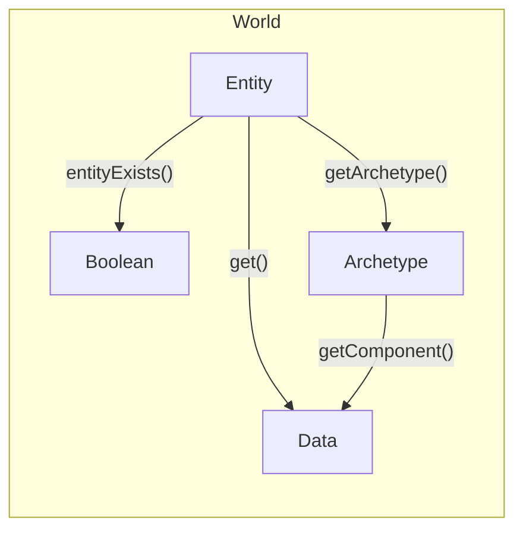
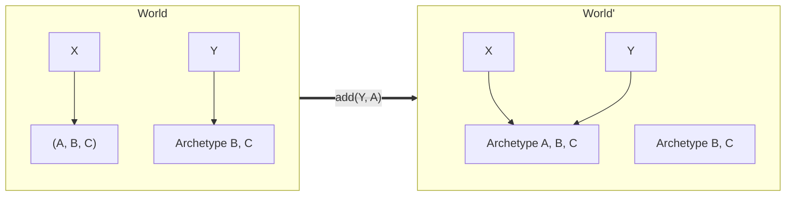

# ECS

This package contains code for logically representing the game world.

### Theory

Every "thing" in the real world _has_ properties, and _does_ behaviors.

A duck _is_ yellow, and it _does_ quack when it's hungry.

Similarly, every "thing" which exists in the video game is composed of properties
and behaviors, too.
These "things" are called **entities**.
Their properties are called **components**.  These are just small chunks of data.
Different behaviors are implemented by running a chunk of code on every entity
which contains the relevant components (think: data) for that behavior.

For example, a `QuackWhenHungry` behavior would be implemented by finding every
entity that has a `DuckComponent` and a `HungryComponent`, and then playing a
quack sound.

### Setup

This package stores components in linear memory so that it's very fast to run
code repeatedly on all components of a type.  In reality, this is V8 JS, so it
could be just storing some kind of pointer in the list, and the components are
really scattered all throughout memory anyway.  I don't have any benchmarks to
say for-sure whether the linear representation of data is truly faster for
running behaviors.

## Operations that Preserve Structure

## Operations that Modify Structure

Adding or removing a component changes the mapping from entities to archetypes.

