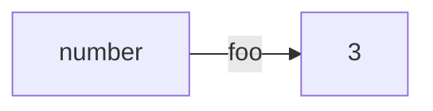
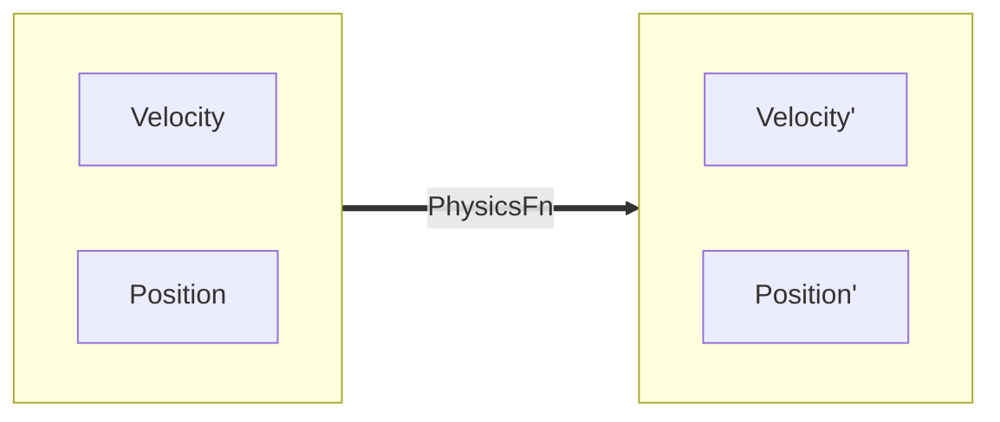
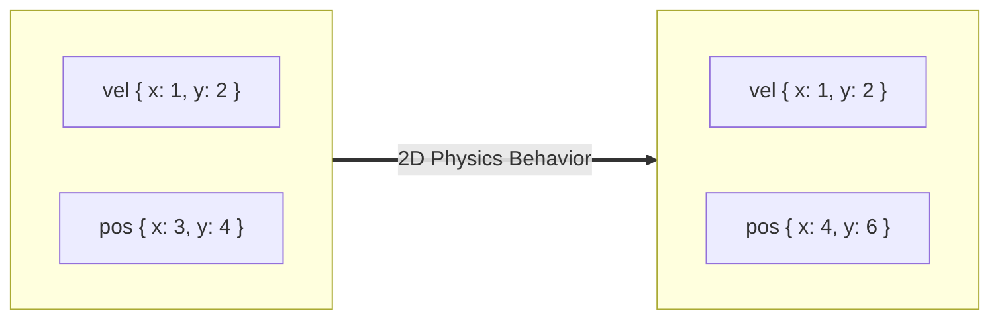
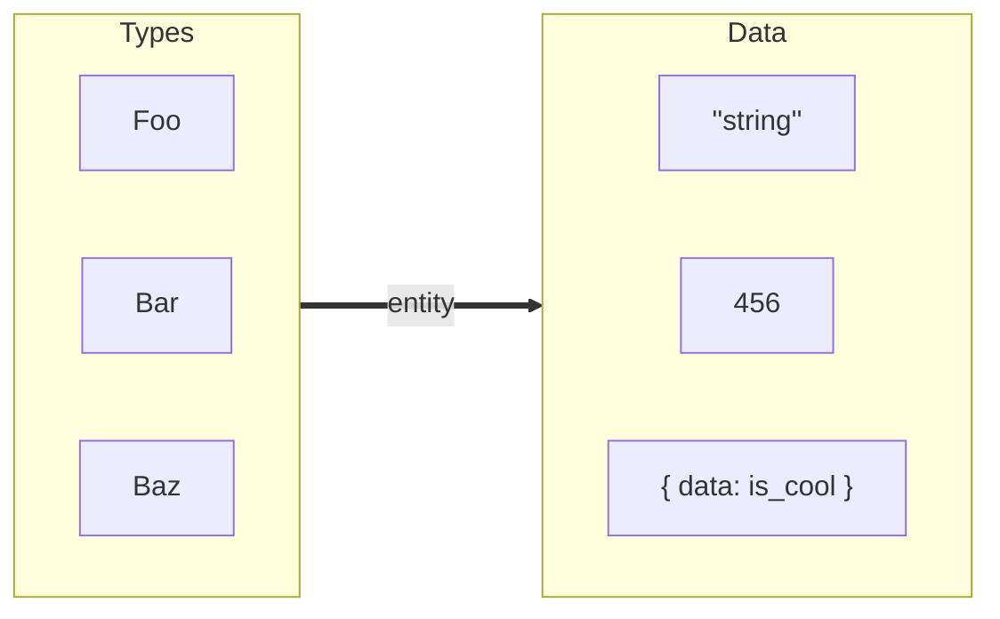
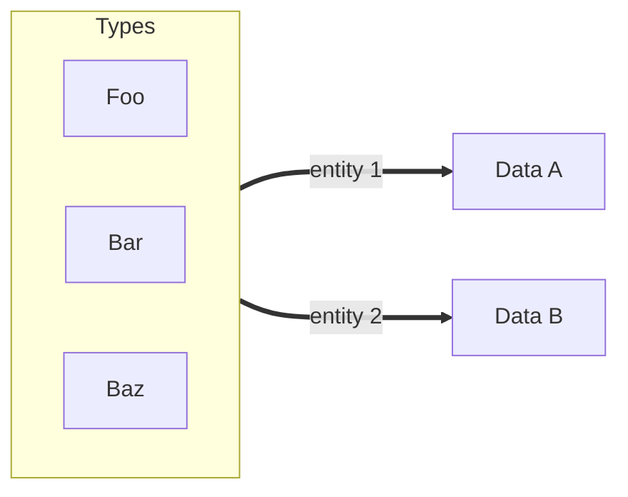

# ECS

This package contains code for logically representing the game world.

## Theory

Every "thing" in the real world _has_ properties, and _does_ behaviors.

A duck _is_ yellow, and it _does_ quack when it's hungry.

Similarly, every "thing" which exists in the video game is composed of properties
and behaviors, too.
These "things" are called **entities**.
Their properties are called **components**.  These are just small chunks of data.
Different behaviors are implemented by running a chunk of code on every entity
which contains the relevant components (think: data) for that behavior.

For example, a `QuackWhenHungry` behavior would be implemented by finding every
entity that has a `DuckComponent` and a `HungryComponent`, and then playing a
quack sound.

## Setup

This package stores components in linear memory so that it's very fast to run
code repeatedly on all components of a type.  In reality, this is V8 JS, so it
could be just storing some kind of pointer in the list, and the components are
really scattered all throughout memory anyway.  I don't have any benchmarks to
say for-sure whether the linear representation of data is truly faster for
running behaviors.

## Variables

A variable is a labelled arrow from a Type to a piece of data in memory.

```js
const foo: number = 3;
```



## Functions and Signatures

A function signature is a labelled arrow from one set of types to another.

```js
type PhysicsFn = (input: [Velocity, Position]) => [Velocity, Position]
```



A function is a labelled arrow from one set of data towards another.

```js
const simulateWorld: PhysicsFn = function([vel, pos]) {
    pos.x += vel.x;
    pos.y += vel.y;
    return [vel, pos];
}
```



## Entity

An entity is a unique map between a set of types and a set of data.




We can use `world.put(entity, types, data)` to make an entity.

```js
// (1) Create an entity
const entity = world.createEntity();
// (2) Create a mapping from types to data
world.put(
    entity,
    [Foo, Bar, Baz],
    [new Foo(), new Bar(), new Baz()]
);
```

Multiple entities are allowed to map `(Foo, Bar, Baz)` to some data.



What if entities are higher-ordered functions?

```js
const makeGoblin = world.entity({
    types: [Physics, Mesh, Health, Archer],
    data() {
        const body = capsule({ height: 3 });
        const mesh = loadModel('goblin.gltf');
        const health = { hp: 3 };
        const archer = true;

        return [body, mesh, health, archer];
    }
});

const goblinOne = makeGoblin();
const goblinTwo = makeGoblin();
```

## Behavior

We can make rules and behaviors using the `world` api.

```js
const physicsBehavior = world.createBehavior({

    // Rule
    from: [Velocity, Position],
    to:   [Velocity, Position],

    // Behavior
    update([vel, pos]) {
        pos.x += vel.x;
        pos.y += vel.y;
    }
});

```

Here's an example of some graphics code that runs when an entity gains the `Mesh` component.

```js
const createMesh = world.createBehavior({
    from: [],
    to: [Mesh],
    update([mesh]) {
        gpu.upload(mesh.vertices);
    }
});
const destroyMesh = world.createBehavior({
    from: [Mesh],
    to: [],
    update([mesh]) {
        gpu.upload(mesh.vertices);
    }
});
```